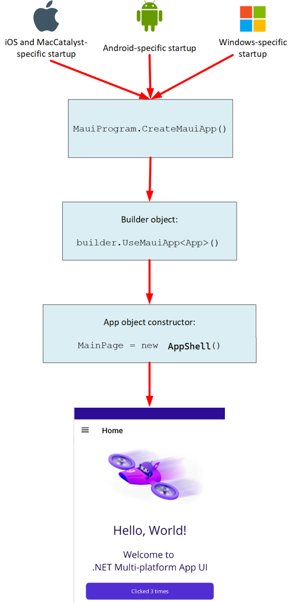

# Build .Net MAUI app using XAML
- when debugging the app, it is pointing to `.csproj` file
- running the app in Windows app
- `dotnet watch` builds app and points to the `.csproj`
- Be patient, it does take a while
- In the end, it said
```
\XamlCentricApp\XamlCentricApp.csproj' targets multiple frameworks. Specify which framework to run using '--framework
```
- `dotnet watch -f net10.0-windows10.0.19041.0` -> this specific to the framework
- SUCCESS! We have a runnable project

### Project Structure
- `App.xaml` 
    - app resources used by the app
    - default resources in `Resources` folder
- `App.xaml.cs`
    - code behing `app.xaml`
    - class represents application at runtime
    - creates the initial window and assigns it to `MainPage` property
    - `MainPage` determines which page is displayed when the application starts running
    - Override common platform-neutral application lifecycle event handlers
        - `Onstart`
        - `OnResume`
        - `OnSleep`
- Lifecyvle Event handler override sample
```
// Optional events to implement for the application lifecycle. The Window created
// above also has lifecycle events that can be used to track the Window lifecycle.
    protected override void OnStart()
    {
        base.OnStart();
    }

    protected override void OnResume()
    {
        base.OnResume();
    }

    protected override void OnSleep()
    {
        base.OnSleep();
    }
```
- `AppShell.xaml` 
    - .Net Maui application's main structure
    - The .NET maui `shell` provides many features that are beneficial for multiple platform apps including app styling, URI based navigation, and options for layout, including flyout navigation and tabs for application's root
- `MainPage.xaml`
    - user-interface definition
    - `VerticalStackLayout` enclosed in a `ScrollView`
    - You can define more XAML pages if you have multi-page app
- `MainPage.xaml.cs`
    - define logc for various event handlers and other actions triggered by the controls on the page
    - the static `Announce` method of the `SemanticScreenReader` class specifies the text announced by a screenreader when the user selects the button
- `MauiProgram.cs`
    - each native platform has a different starting point that creates and initializes the app
    - the code is in the `Platform` folder
    - `CreateMauiApp` method to configure the application by creating an app builder object 
    ```
    using Microsoft.Extensions.Logging;

    namespace MyMauiApp;

    public static class MauiProgram
    {
        public static MauiApp CreateMauiApp()
        {......
        }
    }
    ```
    - At a minimum, we need to specify which class describes my application by using the `UseMauiApp` generic method of the app builder object
    - `<App>` specifies the application class
    - the app builder provides methods for task such as registering fonts, configuring servies for dependency injection, registering custom handlers for controls
    ```
            var builder = MauiApp.CreateBuilder();
        builder
            .UseMauiApp<App>()
            .ConfigureFonts(fonts =>
            {
                fonts.AddFont("OpenSans-Regular.ttf", "OpenSansRegular");
                fonts.AddFont("OpenSans-Semibold.ttf", "OpenSansSemibold");
            });
    ```
    - Flow of control when a .Net MAUI app starts up:
    

    - `.csproj` file
        -  `PropertyGroup` specifies platform frameworks that the project targets 
        ```
        <Project Sdk="Microsoft.NET.Sdk">

	    <PropertyGroup>
            <TargetFrameworks>net10.0-android;net10.0-ios;net10.0-maccatalyst</TargetFrameworks>
            <TargetFrameworks Condition="$([MSBuild]::IsOSPlatform('windows'))">$(TargetFrameworks);net10.0-windows10.0.19041.0</TargetFrameworks>
            <OutputType>Exe</OutputType>
            <RootNamespace>MyMauiApp</RootNamespace>
            <UseMaui>true</UseMaui>
            <SingleProject>true</SingleProject>
            <ImplicitUsings>enable</ImplicitUsings>
            <Nullable>enable</Nullable>
        </PropertyGroup>
        ```
        - `ItemGroup`
            - specifies the image and color of the splash page 
            - set the default locations for fonts, images and assets the app uses
            ```
            <Project Sdk="Microsoft.NET.Sdk">

                ...

                <ItemGroup>
                    <!-- App Icon -->
                    <MauiIcon Include="Resources\AppIcon\appicon.svg" 
                            ForegroundFile="Resources\AppIcon\appiconfg.svg" 
                            Color="#512BD4" />

                    <!-- Splash Screen -->
                    <MauiSplashScreen Include="Resources\Splash\splash.svg" 
                                    Color="#512BD4" 
                                    BaseSize="128,128" />

                    <!-- Images -->
                    <MauiImage Include="Resources\Images\*" />
                    <MauiImage Update="Resources\Images\dotnet_bot.png" 
                            Resize="True" BaseSize="300,185" />

                    <!-- Custom Fonts -->
                    <MauiFont Include="Resources\Fonts\*" />

                    <!-- Raw Assets (also remove the "Resources\Raw" prefix) -->
                    <MauiAsset Include="Resources\Raw\**" 
                            LogicalName="%(RecursiveDir)%(Filename)%(Extension)" />
                </ItemGroup>

                ...

            </Project>
            ```
        - `Resources` folder -> add any fonts, images, and other graphical resources the application requires to this folder and subfolders
        - We can refer fonts in the XAML page based on the fonts being registered in `MauiProgram.cs` -> `MauiProgram` -> `CreateMauiApp` -> `MauiApp.CreateBuilder` -> `UseMauiApp` -> `<App>` -> `ConfigureFonts`
        ```
        <Project Sdk="Microsoft.NET.Sdk">

            ...

            <ItemGroup>
                <!-- App Icon -->
                <MauiIcon Include="Resources\AppIcon\appicon.svg" 
                        ForegroundFile="Resources\AppIcon\appiconfg.svg" 
                        Color="#512BD4" />

                <!-- Splash Screen -->
                <MauiSplashScreen Include="Resources\Splash\splash.svg" 
                                Color="#512BD4" 
                                BaseSize="128,128" />

                <!-- Images -->
                <MauiImage Include="Resources\Images\*" />
                <MauiImage Update="Resources\Images\dotnet_bot.png" 
                        Resize="True" BaseSize="300,185" />

                <!-- Custom Fonts -->
                <MauiFont Include="Resources\Fonts\*" />

                <!-- Raw Assets (also remove the "Resources\Raw" prefix) -->
                <MauiAsset Include="Resources\Raw\**" 
                        LogicalName="%(RecursiveDir)%(Filename)%(Extension)" />
            </ItemGroup>

            ...

        </Project>
        ```
### Project creation
- Note the following:
    - `Resources` -> contains share fonts, images and assets used by all platforms
    - `MauiProgram.cs` -> configures the app and specifies the App class should be used to run the app
    - `App.xaml.cs` -> constructor for the `App` class, creates a new instance of the `AppShell` class which is then displayed in the app window
    - `AppShell.xaml` -> contains the main layout for the applicaiton and starting page of `MainPage`
    - `MainPage.xaml` -> contains the layout of the page like button and label
    - `MainPage.xaml.cs` -> contains the application logic for the page

### Githubby 
- `git rm --cached -r .` -> unstage files

#### Reference
https://learn.microsoft.com/en-us/training/modules/create-user-interface-xaml/1-introduction
